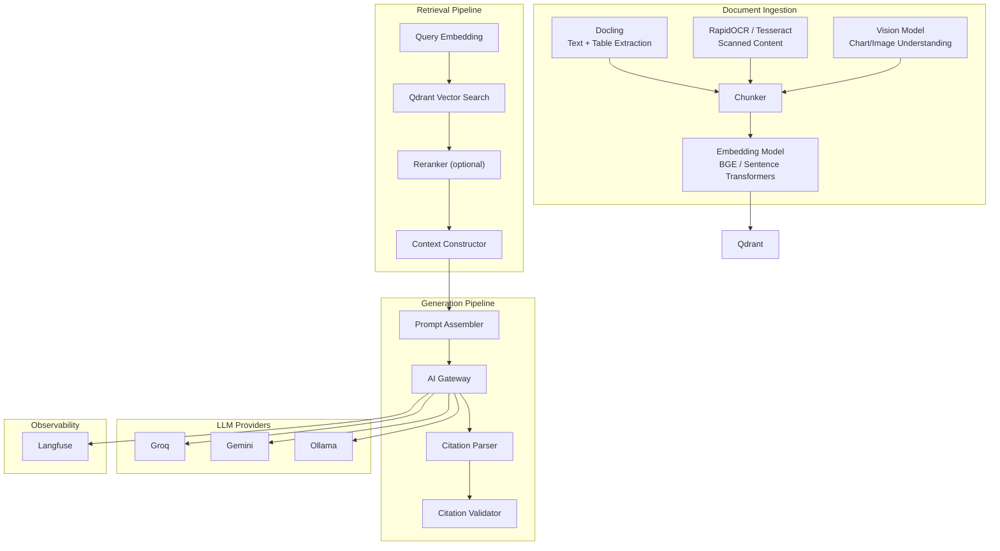
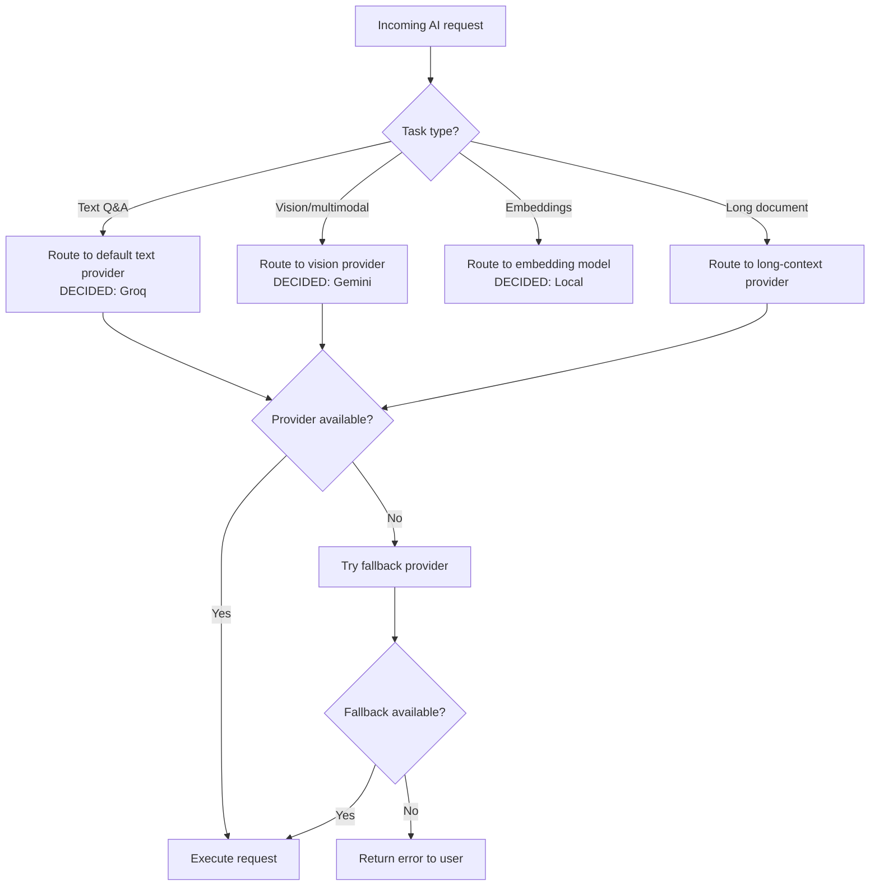
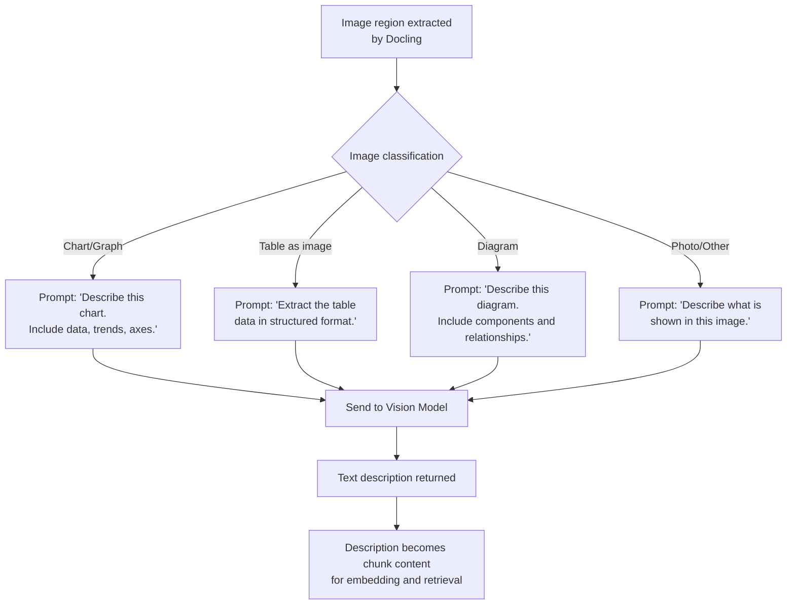
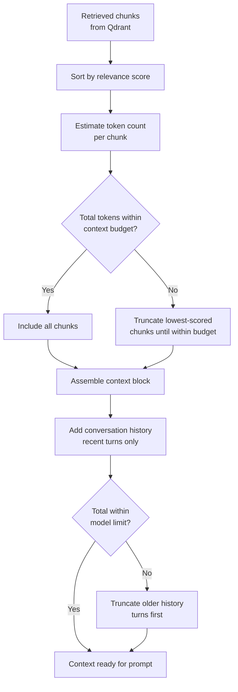
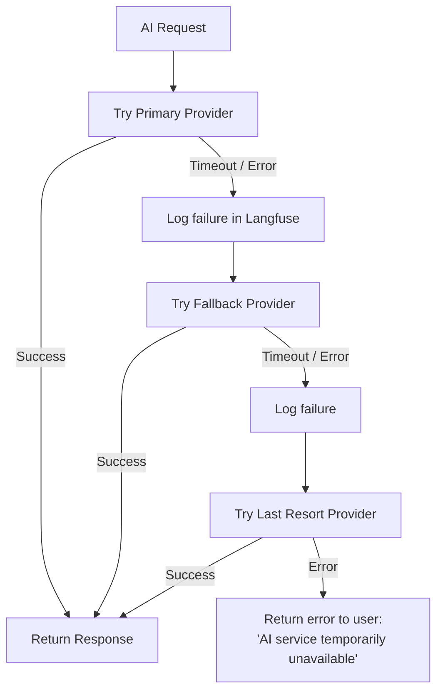
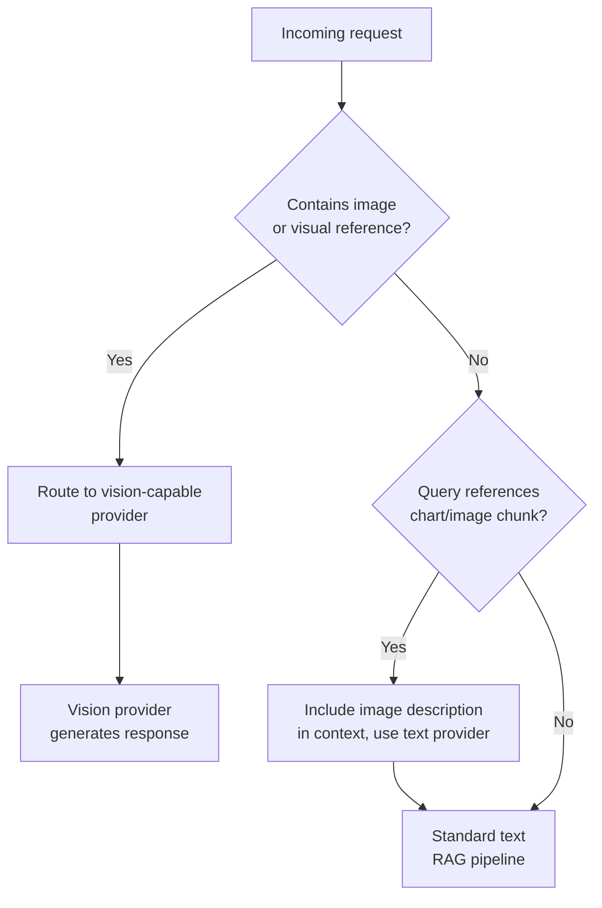

# DocuMind AI — AI Architecture

> **Status:** Draft v1.0
> **Last updated:** 2026-08-15
> **Decision key:** DECIDED · PROPOSED · OPEN DECISION

---

## 1. Overview

The AI architecture covers everything from document understanding to answer generation. It is designed around a **provider-agnostic AI Gateway** that decouples the application from any single LLM vendor.



---

## 2. AI Gateway

**DECIDED:** All LLM calls go through a provider abstraction layer. No part of the application calls a specific LLM provider directly.

### 2.1 Design Principles

1. **Uniform interface.** All providers expose the same method signature for text generation, chat completion, and embedding.
2. **Configuration-driven.** Provider selection, model IDs, and parameters are defined in configuration — not hardcoded.
3. **Fallback chain.** If the primary provider fails, the gateway automatically tries the next provider.
4. **Observable.** Every LLM call is traced via Langfuse with provider, model, tokens, latency, and cost metadata.
5. **Extensible.** Adding a new provider requires implementing the provider interface — no changes to business logic.

### 2.2 Gateway Interface (Conceptual)

```
AIGateway
├── complete(messages, model_config) → CompletionResponse
├── embed(texts, model_config) → EmbeddingResponse
├── complete_with_vision(messages, images, model_config) → CompletionResponse
└── stream(messages, model_config) → AsyncIterator[StreamChunk]

CompletionResponse
├── content: str
├── usage: TokenUsage
├── model: str
├── provider: str
└── latency_ms: float

ProviderConfig
├── provider: str (groq | gemini | ollama)
├── model_id: str
├── api_key: str (from env)
├── base_url: str (optional)
├── max_tokens: int
├── temperature: float
└── timeout_seconds: int
```

### 2.3 Provider Capabilities

| Capability | Groq | Gemini | Ollama |
|------------|------|--------|--------|
| Text generation | ✅ | ✅ | ✅ |
| Chat completion | ✅ | ✅ | ✅ |
| Streaming | ✅ | ✅ | ✅ |
| Vision/multimodal | ❌ | ✅ | ✅ (select models) |
| Embeddings | ❌ | ✅ | ✅ |
| Long context (100K+) | ✅ (select models) | ✅ | Model-dependent |
| Local/private | ❌ | ❌ | ✅ |
| Cost | Free tier | Free tier | Free (self-hosted) |

**DECIDED:** Groq (primary), Gemini (fallback/vision). Ollama is an optional local fallback and not a mandatory dependency.

### 2.4 Routing Strategy

**DECIDED:** Capability-based routing rules.



---

## 3. Embedding Pipeline

### 3.1 Embedding Model

**DECIDED:** BGE-based model family from Sentence Transformers library, run locally behind an embedding abstraction.

| Consideration | Decision |
|---------------|----------|
| Model family | BGE (BAAI General Embedding) |
| Runtime | Sentence Transformers (Python) |
| Execution | Local (on backend/worker machine) |
| Dimension | Model-dependent (typically 384–1024) |
| Cost | Free (local inference) |

Recommended starting point:
- `BAAI/bge-small-en-v1.5` — 384 dim, fast, good for MVP. If quality is insufficient, evaluate `bge-base`.

**DECIDED:** Exact model is an implementation decision. Model family is locked.

### 3.2 Embedding Process

1. Chunk text is cleaned and normalized
2. For table chunks: linearize table into text representation
3. For image chunks: use the vision model's text description
4. Embed using the selected model
5. Store vector + metadata in Qdrant

### 3.3 Query Embedding

- User queries are embedded using the **same model** as document chunks
- Query is optionally prefixed with task instruction (BGE models support instruction-prefixed queries)
- Embedded query is sent to Qdrant for similarity search

---

## 4. Vision / Multimodal Pipeline

### 4.1 When Vision Is Needed

Vision processing is triggered during document ingestion when:
- Docling detects image regions in a document
- Charts, graphs, or diagrams are identified
- Photographs or illustrations are embedded in the document

### 4.2 Vision Processing



**DECIDED:** Vision models generate text descriptions that are then embedded as regular text chunks. This ensures visual content is searchable via the same RAG pipeline.

**DECIDED:** Gemini for vision during MVP (simplicity, quality). Ollama-based VLM as future local alternative.

---

## 5. Retrieval Pipeline

### 5.1 Vector Search

1. Embed user query using the embedding model
2. Search Qdrant with filters:
   - **Required:** `user_id` (security boundary)
   - **Optional:** `document_id` (single-doc chat) or `document_ids` (multi-doc/collection)
3. Return top-K results with scores

**DECIDED:** K = 5–10 retrieved chunks for context. Exact K is tunable per query.

### 5.2 Reranking (PROPOSED for P1)

After initial vector retrieval, optionally rerank results using a cross-encoder model for higher precision.

| Approach | Model | Trade-off |
|----------|-------|-----------|
| No reranking (MVP) | — | Faster, simpler, slightly lower precision |
| Cross-encoder reranking (P1) | `cross-encoder/ms-marco-MiniLM-L-6-v2` or similar | Better precision, adds latency |

**DECIDED (DEFERRED):** Cross-encoder reranking is deferred to P1. Not included in MVP.

### 5.3 Hybrid Search (PROPOSED for future)

Combine vector similarity with keyword matching (BM25) for better recall on exact terms and names.

**OPEN DECISION:** Qdrant supports payload-based keyword filtering but not full BM25. Hybrid search may require PostgreSQL full-text search as a complement. Deferred.

---

## 6. Context Construction

### 6.1 Context Window Management



### 6.2 Context Budget

| Component | Budget (approximate) |
|-----------|---------------------|
| System prompt | ~500 tokens |
| Retrieved chunks | ~3000–4000 tokens |
| Conversation history | ~1000–2000 tokens |
| User query | ~100–500 tokens |
| Reserved for generation | ~1000–2000 tokens |
| **Total** | **~6000–9000 tokens** |

These are rough guidelines. Actual budgets depend on the model's context window and will be configurable.

### 6.3 Chunk Formatting

Each chunk in the context is formatted with metadata to enable citation:

```
[Source: {document_title} | Page: {page_number} | Chunk: {chunk_id}]
{chunk_content}
```

This structured format allows the LLM to reference specific sources in its response.

---

## 7. Prompt Architecture

### 7.1 System Prompt

The system prompt establishes the AI's behavior:

```
You are a document analysis assistant. Your job is to answer questions based
on the provided source documents.

Rules:
1. Only answer based on the provided context. If the context does not contain
   the answer, say "I could not find this information in the provided documents."
2. Always cite your sources using [Source: ...] references from the context.
3. Be precise and factual. Do not speculate beyond what the sources state.
4. If multiple sources provide relevant information, synthesize them and cite all.
5. For tables and data, present information accurately as it appears in the source.
```

**OPEN DECISION:** Final system prompt wording. The above is a starting template. Prompt engineering will iterate based on evaluation results.

### 7.2 Prompt Structure

```
[System Prompt]

[Context]
--- Retrieved Chunks ---
[Source: Document A | Page: 3 | Chunk: abc-123]
Lorem ipsum dolor sit amet...

[Source: Document A | Page: 7 | Chunk: def-456]
Consectetur adipiscing elit...

--- Conversation History ---
User: What is the main finding?
Assistant: The main finding is... [Source: Document A | Page: 3]

--- Current Query ---
User: How does this compare to previous studies?
```

### 7.3 Prompt Variants

| Task | Prompt Modification |
|------|-------------------|
| Q&A | Standard prompt (above) |
| Summarization | "Provide a concise summary of the following document content..." |
| Comparison | "Compare the following two documents, highlighting similarities and differences..." |
| Extraction | "Extract the following structured information from the document: {schema}..." |
| Table reasoning | "Based on the table data provided, answer the following question..." |

---

## 8. Citation Generation

### 8.1 Citation Format

Citations link AI answers to specific source chunks:

```json
{
  "citation_id": "uuid",
  "chunk_id": "uuid",
  "document_id": "uuid",
  "page_number": 3,
  "excerpt": "First 200 characters of the cited chunk...",
  "relevance_score": 0.87
}
```

### 8.2 Citation Extraction

1. LLM is instructed to reference sources using `[Source: ...]` markers
2. Backend parses response text for citation markers
3. Each marker is matched to a retrieved chunk
4. Structured citation objects are created and stored

### 8.3 Citation Validation

Before returning citations to the user:

1. **Existence check:** Does the cited chunk exist in the retrieved set?
2. **Ownership check:** Does the chunk belong to the user's document?
3. **Content check:** Does the excerpt reasonably match the chunk content?
4. **Page check:** Does the page number match the chunk metadata?

Invalid citations are logged (via Langfuse) and excluded from the response.

---

## 9. Hallucination Mitigation

| Strategy | Implementation |
|----------|----------------|
| Grounded generation | System prompt instructs LLM to only use provided context |
| "I don't know" | Explicit instruction to refuse when answer is not in context |
| Citation requirement | Every factual claim must reference a source |
| Citation validation | Backend verifies citations against retrieved chunks |
| Temperature control | Low temperature (0.1–0.3) for factual Q&A |
| Context sufficiency check | If retrieval returns no relevant chunks (all scores below threshold), inform user instead of generating |
| Faithfulness evaluation | Langfuse traces enable post-hoc faithfulness checks |

**OPEN DECISION:** Retrieval score threshold below which the system declines to answer. Needs empirical tuning.

---

## 10. Model Fallback Strategy



**PROPOSED fallback chain:**

| Priority | Provider | Rationale |
|----------|----------|-----------|
| 1 | Groq | Fast, primary for text Q&A |
| 2 | Gemini | Good quality, multimodal support |
| 3 | Ollama | Optional local fallback, no API dependency |

For vision tasks:
| Priority | Provider | Rationale |
|----------|----------|-----------|
| 1 | Gemini | Best multimodal quality |
| 2 | Ollama (VLM) | Optional local fallback |

**DECIDED:** Fallback is automatic and transparent to the user. The response metadata includes which provider was used.

---

## 11. Multimodal Routing



**Design principle:** During ingestion, vision models convert images to text descriptions. At query time, most queries can be handled by text-only models using these descriptions. Direct vision model calls at query time are only needed if the user explicitly asks about an image that requires re-analysis.

---

## 12. Observability (Langfuse Integration)

| What is Traced | Metadata |
|----------------|----------|
| Every LLM call | Provider, model, input/output tokens, latency, cost estimate |
| Retrieval | Query, num results, top scores, Qdrant latency |
| Full RAG chain | End-to-end latency, component breakdown |
| Errors | Provider failures, timeout, fallback triggers |
| Citations | Generated vs. validated count, invalid citation rate |

**DECIDED:** Langfuse for LLM observability. Non-critical path — application works without it.

---

## 13. Future Extensibility

| Extension | How the Architecture Supports It |
|-----------|----------------------------------|
| New LLM provider (e.g., Anthropic, OpenAI) | Implement provider interface, add to config |
| New embedding model | Swap model in config; re-embed documents if dimensions change |
| Fine-tuned models | Deploy via Ollama, configure as a provider |
| Agentic workflows | AI Gateway already supports chained calls |
| Multi-language support | Swap to multilingual embedding model (e.g., BGE-M3) |
| Real-time processing | Replace polling with streaming; Gateway already supports `stream()` |

---

## 14. Open Decisions Summary

| ID | Decision | Status |
|----|----------|--------|
| OD-AI-05 | Hybrid search (vector + BM25) | OPEN DECISION, deferred |
| OD-AI-06 | System prompt final wording | OPEN DECISION, iterative |
| OD-AI-07 | Retrieval score threshold for declining to answer | OPEN DECISION, needs tuning |
| OD-AI-08 | Chunking strategy | OPEN DECISION (see ARCHITECTURE.md) |
