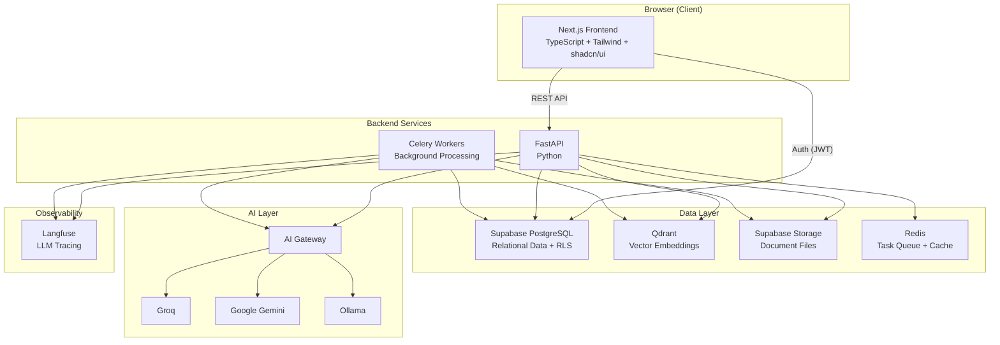
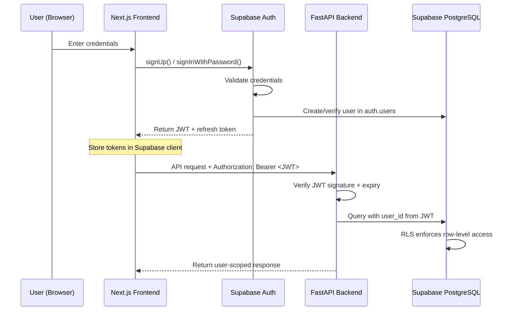
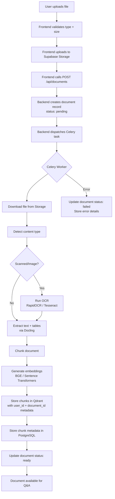
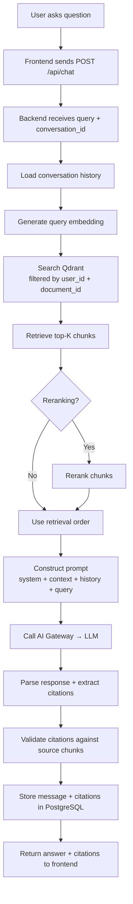
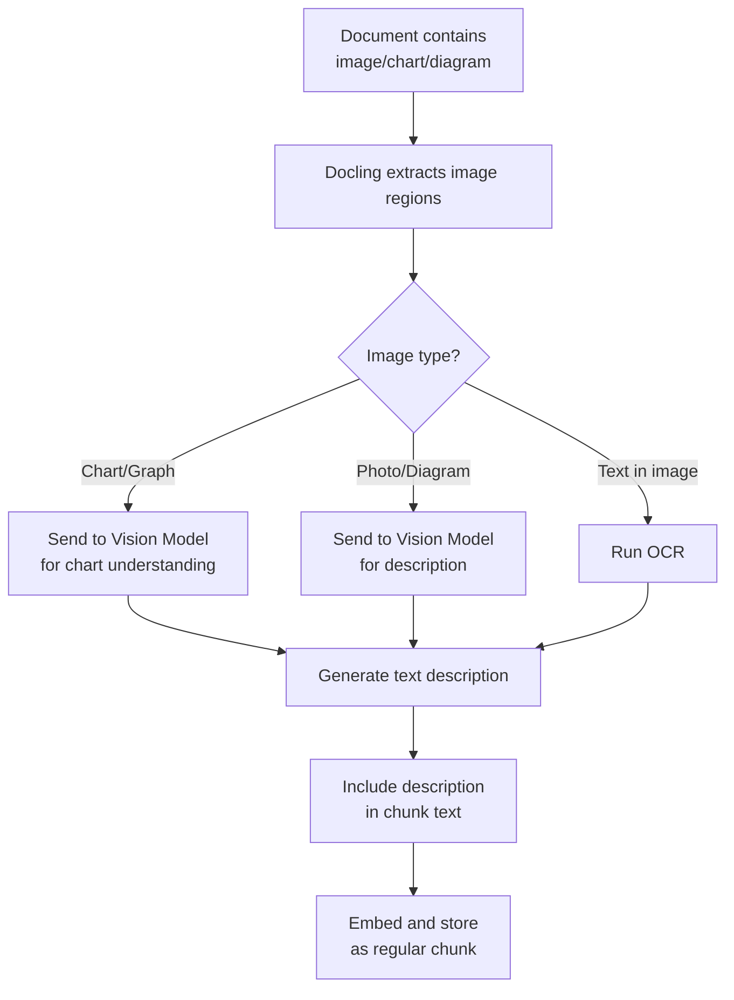
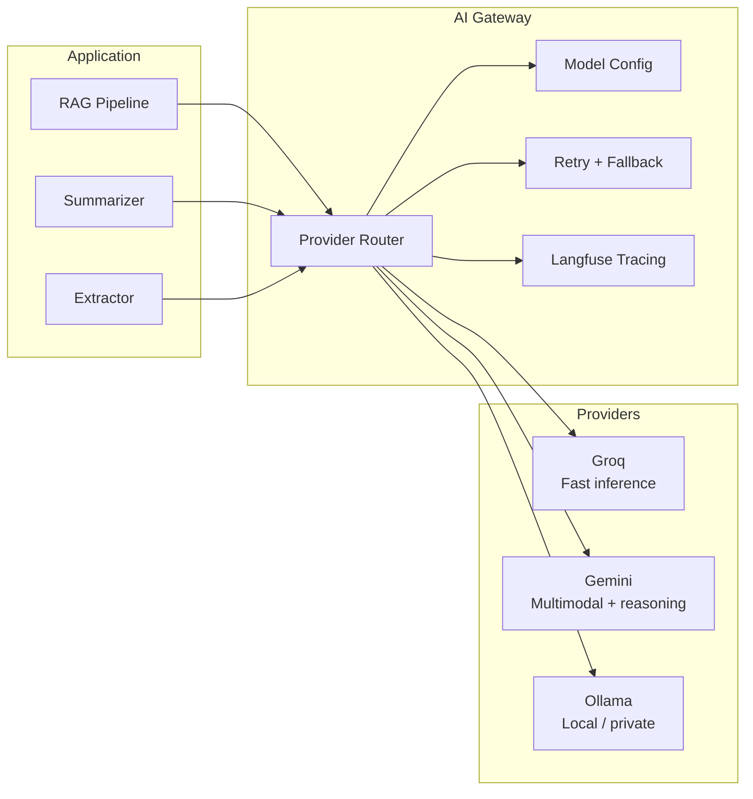
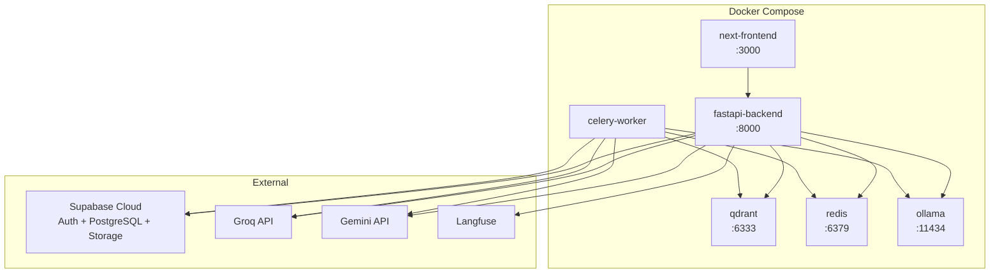
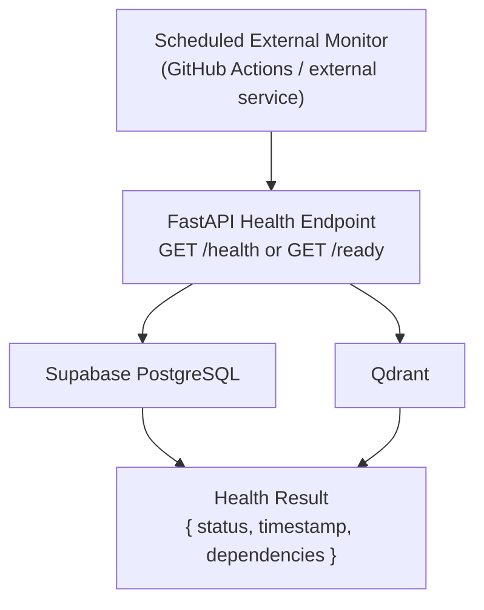

# DocuMind AI — System Architecture

> **Status:** Draft v1.0
> **Last updated:** 2026-08-15
> **Decision key:** DECIDED · PROPOSED · OPEN DECISION

---

## 1. System Overview

DocuMind AI is a full-stack web application with a decoupled frontend and backend, connected to managed services for authentication, storage, and vector search.



---

## 2. Major Components

| Component | Technology | Responsibility |
|-----------|-----------|----------------|
| Frontend | Next.js, TypeScript, Tailwind CSS, shadcn/ui | UI, user interactions, auth state, document viewing |
| Backend API | FastAPI, Python | Business logic, document processing orchestration, RAG pipeline, API endpoints |
| Background Workers | Celery, Redis | Async document processing, embedding generation, long-running tasks |
| Relational Database | Supabase PostgreSQL | Users, documents, conversations, messages, citations, jobs, metadata |
| Vector Database | Qdrant | Document chunk embeddings, semantic search |
| File Storage | Supabase Storage | Original uploaded documents |
| Authentication | Supabase Auth | User registration, login, JWT tokens, session management |
| AI Gateway | Custom Python abstraction | LLM provider routing (Groq, Gemini, Ollama) |
| Observability | Langfuse | LLM call tracing, latency monitoring, cost tracking |

**DECIDED:** All above technology choices.

---

## 3. Frontend Responsibilities

The Next.js frontend is responsible for:

- **Authentication UI:** Login, signup, password reset forms (using Supabase Auth client SDK)
- **Dashboard:** Document list, upload interface, processing status
- **Document viewer:** Display uploaded documents alongside chat
- **Chat interface:** Send questions, display AI answers with citations
- **Collections UI:** Create/manage document groups
- **Settings:** User preferences, account management
- **State management:** Client-side state for UI interactions

The frontend does **NOT**:
- Process documents
- Call LLM providers directly
- Access Qdrant directly
- Store or cache document content outside the browser session

**DECIDED:** The frontend communicates with the backend exclusively via REST API, except for Supabase Auth which uses the client SDK directly.

---

## 4. Backend Responsibilities

The FastAPI backend is responsible for:

- **API layer:** All REST endpoints for documents, conversations, chat, collections
- **Authentication verification:** Validate Supabase JWT tokens on every request
- **Document processing orchestration:** Dispatch processing jobs to Celery workers
- **RAG pipeline:** Query Qdrant, construct context, call AI Gateway, return cited answers
- **AI Gateway:** Abstract LLM provider selection and call routing
- **Storage management:** Generate signed URLs, manage file lifecycle
- **Business logic:** Authorization checks, rate limiting, input validation

---

## 5. Authentication Flow

**DECIDED:** Supabase Auth with JWT tokens.



**Key decisions:**
- Frontend uses `@supabase/supabase-js` for auth flows
- Backend validates JWT on every request (no trust of frontend-only filtering)
- User profile record created via database trigger on `auth.users` insert
- RLS policies enforce data isolation at the database level

---

## 6. Document Ingestion Flow



**Processing steps in detail:**

1. **Upload:** File validated client-side (type, size), uploaded to Supabase Storage bucket
2. **Registration:** Backend creates a `documents` row with `status: pending`
3. **Dispatch:** Processing task enqueued via Celery/Redis
4. **Extraction:** Docling extracts text, tables, and structural metadata
5. **OCR:** If scanned content detected, run OCR pipeline
6. **Chunking:** Document split into semantically meaningful chunks
7. **Embedding:** Each chunk embedded using the configured embedding model
8. **Vector storage:** Embeddings stored in Qdrant with `user_id` and `document_id` metadata
9. **Relational metadata:** Chunk metadata (page numbers, positions) stored in PostgreSQL
10. **Completion:** Document status updated to `ready` or `failed`

**OPEN DECISION:** Exact chunking strategy (fixed-size, semantic, hybrid).

---

## 7. RAG Flow



**Key design points:**
- Retrieval is always scoped by `user_id` and optionally `document_id(s)`
- Context window managed by truncation/selection strategy
- Citations are structured references (document, page, chunk) — not just inline text
- Citation validation ensures references point to actual retrieved chunks

**OPEN DECISION:** Reranking model selection (cross-encoder vs. none for MVP).

---

## 8. Multimodal Processing Flow



**DECIDED:** Multimodal processing uses vision-capable models (Gemini or open-source VLM) to generate text descriptions of visual content, which are then embedded and searchable like text.

**OPEN DECISION:** Specific vision model (Gemini vs. open-source VLM like LLaVA).

---

## 9. AI Gateway Architecture

**DECIDED:** The application uses a provider abstraction layer, not direct LLM calls.



**Provider characteristics (PROPOSED):**

| Provider | Strength | Use Case |
|----------|----------|----------|
| Groq | Fast inference, low latency | Primary chat/Q&A for text-only queries |
| Gemini | Multimodal, large context | Vision tasks, chart understanding, long documents |
| Ollama | Local, private, no API cost | Development, privacy-sensitive workloads, fallback |

**OPEN DECISION:** Exact routing rules (cost-based, capability-based, user-configurable).

---

## 10. Storage Architecture

### 10.1 Supabase Storage (File Storage)

- **Purpose:** Store original uploaded document files
- **Organization:** Buckets per content type or single bucket with path prefixes
- **Access:** Signed URLs generated by the backend, scoped to authenticated user
- **Retention:** Files persist until user deletes the document

**PROPOSED:** Single bucket `documents` with path structure: `{user_id}/{document_id}/{filename}`

### 10.2 Supabase PostgreSQL (Relational Data)

- **Purpose:** All structured application data
- **Contents:** Users, documents, conversations, messages, citations, jobs, chunk metadata, collections
- **Security:** Row Level Security (RLS) on all user-scoped tables
- **Connection:** Backend connects via connection pooler (Supavisor)

### 10.3 Qdrant (Vector Data)

- **Purpose:** Store and search document chunk embeddings
- **Organization:** Single collection with metadata filtering
- **Metadata per point:** `user_id`, `document_id`, `chunk_id`, `page_number`, `chunk_type`
- **Search:** Filtered by `user_id` and optionally `document_id(s)` on every query
- **Isolation:** No cross-user retrieval is possible when filters are applied correctly

**PROPOSED:** Single Qdrant collection `document_chunks` with payload-based filtering.

**OPEN DECISION:** Multiple Qdrant collections (per-user or per-document) vs. single collection with filtering. Single collection with metadata filtering is proposed for simplicity at MVP scale.

### 10.4 Redis

- **Purpose:** Celery task broker, optional caching layer
- **Data:** Task queue messages, processing job status, optional query cache
- **Persistence:** Not required for task queue (ephemeral). Cache data is expendable.

---

## 11. Background Jobs Architecture

**DECIDED:** Celery + Redis for async task processing.

| Job Type | Trigger | Worker Action |
|----------|---------|---------------|
| Document processing | Document upload | Extract, OCR, chunk, embed, store |
| Re-processing | User request or admin | Re-extract and re-embed document |
| Batch embedding | System task | Generate embeddings for pending chunks |
| Cleanup | Document deletion | Remove vectors from Qdrant, files from Storage |

**Job lifecycle:**
1. API creates `processing_jobs` record with `status: queued`
2. Celery task dispatched with job ID
3. Worker updates status: `queued` → `processing` → `completed` / `failed`
4. Frontend can poll job status via API
5. Failed jobs store error details for debugging

**OPEN DECISION:** Whether to use WebSocket/SSE for real-time processing status or polling.

---

## 12. External Services

| Service | Purpose | Self-hosted? | Cost |
|---------|---------|-------------|------|
| Supabase | Auth, PostgreSQL, Storage | Cloud (free tier available) | Free tier for dev |
| Qdrant | Vector search | Self-hosted via Docker | Free (OSS) |
| Redis | Task queue | Self-hosted via Docker | Free (OSS) |
| Groq | LLM inference | Cloud API | Free tier available |
| Google Gemini | LLM + vision | Cloud API | Free tier available |
| Ollama | Local LLM | Self-hosted | Free (OSS) |
| Langfuse | LLM observability | Cloud or self-hosted | Free tier / OSS |

---

## 13. Failure Boundaries

| Failure | Impact | Mitigation |
|---------|--------|------------|
| Supabase down | Auth, DB, storage unavailable | Application is unavailable; no self-hosted fallback |
| Qdrant down | Vector search unavailable | Chat/Q&A fails gracefully; documents still viewable |
| Redis down | No new processing jobs | Queue recovers on restart; existing jobs may need retry |
| Groq API down | Primary LLM unavailable | AI Gateway falls back to Gemini or Ollama |
| Gemini API down | Vision/multimodal unavailable | Degrade to text-only processing; fallback to Groq |
| Ollama down | Local LLM unavailable | Fall back to cloud providers |
| Celery worker crash | Processing job fails | Job marked as `failed`; user can retry |
| Langfuse down | No LLM tracing | Non-critical; application continues without observability |

**Design principle:** Failures in the AI/vector layer should degrade gracefully (show error, suggest retry) rather than crash the application. Failures in auth/database are hard dependencies.

---

## 14. High-Level Deployment Architecture

**PROPOSED:** Docker Compose for development and initial deployment.



**DECIDED:** Development uses Docker Compose with locally-run Qdrant, Redis, and Ollama alongside cloud services (Supabase, Groq, Gemini).

**OPEN DECISION:** Production deployment target (VPS, cloud VM, container platform, serverless). Deferred until post-MVP.

---

## 15. Health Monitoring & Service Availability

### 15.1 Purpose

The backend exposes a health endpoint for **legitimate operational monitoring**: verifying that the process is running and that critical infrastructure dependencies are reachable. This is not a mechanism for defeating cloud provider inactivity policies — it is standard production observability practice.

### 15.2 Liveness vs. Readiness

| Concept | Question | Failure Meaning |
|---------|----------|-----------------|
| **Liveness** | Is the backend process alive? | Process has crashed or is deadlocked |
| **Readiness** | Can the backend serve requests? | A critical dependency (database, vector store) is unreachable |

The eventual implementation may expose both as separate endpoints:

| Endpoint | Concept | Description |
|----------|---------|-------------|
| `GET /health` | Liveness | Backend process is running; lightweight, always fast |
| `GET /ready` | Readiness | All critical dependencies are reachable; slightly heavier |

Neither endpoint is implemented yet. See `API_SPEC.md` for the conceptual design.

### 15.3 Dependency Checks

The readiness probe checks the following infrastructure boundaries:

| Dependency | Check | Method |
|------------|-------|--------|
| Supabase PostgreSQL | Database is reachable | Lightweight query (e.g., `SELECT 1`) |
| Qdrant | Vector store is reachable | Qdrant status or collections API |

Dependency checks are **read-only** and return no user data, no document content, and no secrets.

### 15.4 Health Check Architecture



The monitor calls the backend health endpoint, which checks its infrastructure dependencies and returns a structured status result. The monitor then alerts on failure.

### 15.5 Infrastructure Abstraction

Health checks interact with the infrastructure layer — the same boundary used by all other services — and do not embed provider-specific logic in business logic:

```
FastAPI Health Endpoint
        ↓
Health Check Service
        ↓
Infrastructure Interfaces
        ├── Database Repository   (Supabase)
        └── Vector Store Client  (Qdrant)
```

This keeps provider-specific connection details inside their respective infrastructure adapters, not scattered through application code.

### 15.6 Scheduled External Monitoring

In production, an external scheduler periodically calls the health endpoint to detect outages. Candidates include:

- GitHub Actions (scheduled workflow)
- A free uptime monitoring service
- Another appropriate scheduler

**Scheduling guidance:**
- The cadence should be appropriate for operational awareness — not unnecessarily frequent
- Every few minutes to every few days depending on the production SLA
- Do **not** use per-minute or per-second polling for a portfolio or early-stage deployment
- Do **not** use browser-based polling or client-side loops for infrastructure health
- The scheduler is for operational visibility, not for gaming provider inactivity policies

### 15.7 Supabase Free-Tier Availability

Supabase free-tier projects may be paused after a period of low activity. The following positions are documented explicitly:

| Position | Statement |
|----------|-----------|
| Health checks do NOT guarantee activity prevention | Supabase's inactivity policy is not defeated by external pings |
| No circumvention intent | The monitoring system is designed for operational health, not policy gaming |
| Manual resume is always available | If a dev/portfolio project is paused, it can be resumed manually through the Supabase dashboard |
| Paid plans for guaranteed availability | If continuous availability is required for production, a paid Supabase plan (or alternative provider) should be evaluated |
| Free-tier behaviour is not permanent | Supabase's inactivity policy may change; do not design the system around any assumption about it |

### 15.8 Health Response Contract

The health endpoint returns a structured response with no sensitive information:

```json
{
  "status": "healthy",
  "timestamp": "2026-08-15T12:00:00Z",
  "dependencies": {
    "database": "healthy",
    "vector_store": "healthy"
  }
}
```

What the response MUST NOT include:

- Database connection strings or credentials
- API keys or tokens
- Internal hostnames or ports
- Stack traces or error details
- User data or document content

See `SECURITY.md` §17 for full security requirements for this endpoint.

---

## 16. Open Decisions Summary

| ID | Decision | Status |
|----|----------|--------|
| OD-ARCH-01 | Chunking strategy (fixed-size, semantic, hybrid) | OPEN DECISION |
| OD-ARCH-02 | Reranking model for retrieval | OPEN DECISION |
| OD-ARCH-03 | Vision model (Gemini vs. open-source VLM) | OPEN DECISION |
| OD-ARCH-04 | AI Gateway routing rules | OPEN DECISION |
| OD-ARCH-05 | Qdrant collection strategy (single vs. multiple) | PROPOSED: single |
| OD-ARCH-06 | Real-time status updates (WebSocket/SSE vs. polling) | OPEN DECISION |
| OD-ARCH-07 | Production deployment target | OPEN DECISION |
| OD-ARCH-08 | External monitoring provider (GitHub Actions / uptime service) | OPEN DECISION |
| OD-ARCH-09 | Health check cadence for production monitoring | OPEN DECISION |
| OD-ARCH-10 | Separate `/health` + `/ready` vs. single endpoint | PROPOSED: separate |
