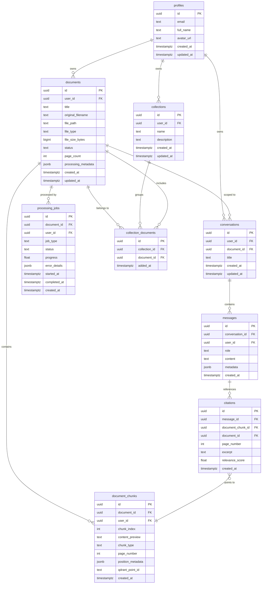

# DocuMind AI — Database Schema

> **Status:** Draft v1.0
> **Last updated:** 2026-08-15
> **Decision key:** DECIDED · PROPOSED · OPEN DECISION

---

## 1. Overview

The relational data model lives in **Supabase PostgreSQL**. Vector data (embeddings) lives in **Qdrant** and is NOT duplicated in PostgreSQL.

PostgreSQL stores:
- User profiles
- Document metadata and ownership
- Chunk metadata (positions, page numbers — not vectors)
- Conversations and messages
- Citations linking answers to source chunks
- Collections for grouping documents
- Processing job tracking

All user-scoped tables enforce **Row Level Security (RLS)**.

---

## 2. Entity-Relationship Diagram

---

## 3. Table Definitions

### 3.1 `profiles`

**Purpose:** User profile data, extending `auth.users` managed by Supabase Auth.

| Column | Type | Constraints | Description |
|--------|------|-------------|-------------|
| `id` | `uuid` | PK, references `auth.users(id)` | User ID from Supabase Auth |
| `email` | `text` | NOT NULL | User email (synced from auth) |
| `full_name` | `text` | NULLABLE | Display name |
| `avatar_url` | `text` | NULLABLE | Profile image URL |
| `created_at` | `timestamptz` | NOT NULL, DEFAULT now() | Account creation time |
| `updated_at` | `timestamptz` | NOT NULL, DEFAULT now() | Last profile update |

**Primary Key:** `id`
**Foreign Keys:** `id` → `auth.users(id)` ON DELETE CASCADE
**Indexes:** `email` (unique)
**RLS:** Users can read/update only their own row. Insert triggered automatically by database function on `auth.users` insert.

**DECIDED:** Profile creation uses a PostgreSQL trigger on `auth.users` — the backend does not manually create profiles.

---

### 3.2 `documents`

**Purpose:** Metadata for uploaded documents. The actual files are in Supabase Storage; vectors are in Qdrant.

| Column | Type | Constraints | Description |
|--------|------|-------------|-------------|
| `id` | `uuid` | PK, DEFAULT gen_random_uuid() | Document ID |
| `user_id` | `uuid` | NOT NULL, FK → profiles(id) | Owner |
| `title` | `text` | NOT NULL | Display title (defaults to filename) |
| `original_filename` | `text` | NOT NULL | Original uploaded filename |
| `file_path` | `text` | NOT NULL | Path in Supabase Storage |
| `file_type` | `text` | NOT NULL | MIME type or extension (pdf, docx, png, jpg) |
| `file_size_bytes` | `bigint` | NOT NULL | File size in bytes |
| `status` | `text` | NOT NULL, DEFAULT 'pending' | Processing status |
| `page_count` | `int` | NULLABLE | Total pages (populated after processing) |
| `processing_metadata` | `jsonb` | NULLABLE | Processing details (extraction stats, errors) |
| `created_at` | `timestamptz` | NOT NULL, DEFAULT now() | Upload time |
| `updated_at` | `timestamptz` | NOT NULL, DEFAULT now() | Last update |

**Primary Key:** `id`
**Foreign Keys:** `user_id` → `profiles(id)` ON DELETE CASCADE
**Indexes:**
- `idx_documents_user_id` on `(user_id)`
- `idx_documents_status` on `(status)`
- `idx_documents_user_id_created_at` on `(user_id, created_at DESC)`

**Status values:** `pending` → `processing` → `ready` | `failed`

**RLS:** Users can CRUD only documents where `user_id = auth.uid()`.

---

### 3.3 `document_chunks`

**Purpose:** Metadata for document chunks. The actual vector embeddings live in Qdrant. This table stores positional information and a content preview for citation display.

| Column | Type | Constraints | Description |
|--------|------|-------------|-------------|
| `id` | `uuid` | PK, DEFAULT gen_random_uuid() | Chunk ID |
| `document_id` | `uuid` | NOT NULL, FK → documents(id) | Parent document |
| `user_id` | `uuid` | NOT NULL, FK → profiles(id) | Owner (denormalized for RLS) |
| `chunk_index` | `int` | NOT NULL | Position within document |
| `content_preview` | `text` | NULLABLE | First ~200 chars for citation preview |
| `chunk_type` | `text` | NOT NULL, DEFAULT 'text' | Type: text, table, image_description |
| `page_number` | `int` | NULLABLE | Source page number |
| `position_metadata` | `jsonb` | NULLABLE | Bounding box, section heading, etc. |
| `qdrant_point_id` | `text` | NOT NULL | Corresponding Qdrant point ID |
| `created_at` | `timestamptz` | NOT NULL, DEFAULT now() | Creation time |

**Primary Key:** `id`
**Foreign Keys:**
- `document_id` → `documents(id)` ON DELETE CASCADE
- `user_id` → `profiles(id)` ON DELETE CASCADE

**Indexes:**
- `idx_chunks_document_id` on `(document_id)`
- `idx_chunks_user_id` on `(user_id)`
- `idx_chunks_qdrant_point_id` on `(qdrant_point_id)` (unique)

**RLS:** Users can read only chunks where `user_id = auth.uid()`.

**Design note:** `user_id` is denormalized here (could be derived via `documents`) to simplify RLS policies and avoid joins in security-critical paths.

---

### 3.4 `conversations`

**Purpose:** Chat conversations, each scoped to a user and optionally to a specific document.

| Column | Type | Constraints | Description |
|--------|------|-------------|-------------|
| `id` | `uuid` | PK, DEFAULT gen_random_uuid() | Conversation ID |
| `user_id` | `uuid` | NOT NULL, FK → profiles(id) | Owner |
| `document_id` | `uuid` | NULLABLE, FK → documents(id) | Scoped document (NULL for multi-doc) |
| `title` | `text` | NULLABLE | Conversation title (auto-generated or user-set) |
| `created_at` | `timestamptz` | NOT NULL, DEFAULT now() | Creation time |
| `updated_at` | `timestamptz` | NOT NULL, DEFAULT now() | Last message time |

**Primary Key:** `id`
**Foreign Keys:**
- `user_id` → `profiles(id)` ON DELETE CASCADE
- `document_id` → `documents(id)` ON DELETE SET NULL

**Indexes:**
- `idx_conversations_user_id` on `(user_id)`
- `idx_conversations_user_id_updated_at` on `(user_id, updated_at DESC)`

**RLS:** Users can CRUD only conversations where `user_id = auth.uid()`.

**Design note:** `document_id` is NULLABLE to support multi-document conversations (P1). For multi-document chats, the specific documents are determined by the collection or explicit document selection at query time.

---

### 3.5 `messages`

**Purpose:** Individual messages within a conversation (both user questions and AI responses).

| Column | Type | Constraints | Description |
|--------|------|-------------|-------------|
| `id` | `uuid` | PK, DEFAULT gen_random_uuid() | Message ID |
| `conversation_id` | `uuid` | NOT NULL, FK → conversations(id) | Parent conversation |
| `user_id` | `uuid` | NOT NULL, FK → profiles(id) | Owner (denormalized for RLS) |
| `role` | `text` | NOT NULL | 'user' or 'assistant' |
| `content` | `text` | NOT NULL | Message text |
| `metadata` | `jsonb` | NULLABLE | Model used, token count, latency, etc. |
| `created_at` | `timestamptz` | NOT NULL, DEFAULT now() | Message time |

**Primary Key:** `id`
**Foreign Keys:**
- `conversation_id` → `conversations(id)` ON DELETE CASCADE
- `user_id` → `profiles(id)` ON DELETE CASCADE

**Indexes:**
- `idx_messages_conversation_id` on `(conversation_id)`
- `idx_messages_conversation_id_created_at` on `(conversation_id, created_at ASC)`

**RLS:** Users can read/insert only messages where `user_id = auth.uid()`.

---

### 3.6 `citations`

**Purpose:** Link AI-generated answers (messages) to the specific source chunks they reference.

| Column | Type | Constraints | Description |
|--------|------|-------------|-------------|
| `id` | `uuid` | PK, DEFAULT gen_random_uuid() | Citation ID |
| `message_id` | `uuid` | NOT NULL, FK → messages(id) | The AI message containing this citation |
| `document_chunk_id` | `uuid` | NOT NULL, FK → document_chunks(id) | Referenced chunk |
| `document_id` | `uuid` | NOT NULL, FK → documents(id) | Referenced document (denormalized) |
| `page_number` | `int` | NULLABLE | Page number of the cited content |
| `excerpt` | `text` | NULLABLE | Short excerpt from the source |
| `relevance_score` | `float` | NULLABLE | Retrieval relevance score |
| `created_at` | `timestamptz` | NOT NULL, DEFAULT now() | Creation time |

**Primary Key:** `id`
**Foreign Keys:**
- `message_id` → `messages(id)` ON DELETE CASCADE
- `document_chunk_id` → `document_chunks(id)` ON DELETE CASCADE
- `document_id` → `documents(id)` ON DELETE CASCADE

**Indexes:**
- `idx_citations_message_id` on `(message_id)`
- `idx_citations_document_id` on `(document_id)`

**RLS:** Inherits access through `messages` (user can read citations for their own messages). Alternatively, add `user_id` column for direct RLS.

**PROPOSED:** Add `user_id` to `citations` for simpler RLS, same denormalization pattern as `document_chunks`.

---

### 3.7 `collections`

**Purpose:** Named groups of documents for organizing related files.

| Column | Type | Constraints | Description |
|--------|------|-------------|-------------|
| `id` | `uuid` | PK, DEFAULT gen_random_uuid() | Collection ID |
| `user_id` | `uuid` | NOT NULL, FK → profiles(id) | Owner |
| `name` | `text` | NOT NULL | Collection name |
| `description` | `text` | NULLABLE | Optional description |
| `created_at` | `timestamptz` | NOT NULL, DEFAULT now() | Creation time |
| `updated_at` | `timestamptz` | NOT NULL, DEFAULT now() | Last update |

**Primary Key:** `id`
**Foreign Keys:** `user_id` → `profiles(id)` ON DELETE CASCADE
**Indexes:** `idx_collections_user_id` on `(user_id)`
**RLS:** Users can CRUD only collections where `user_id = auth.uid()`.

---

### 3.8 `collection_documents`

**Purpose:** Many-to-many join table linking documents to collections.

| Column | Type | Constraints | Description |
|--------|------|-------------|-------------|
| `id` | `uuid` | PK, DEFAULT gen_random_uuid() | Row ID |
| `collection_id` | `uuid` | NOT NULL, FK → collections(id) | Collection |
| `document_id` | `uuid` | NOT NULL, FK → documents(id) | Document |
| `added_at` | `timestamptz` | NOT NULL, DEFAULT now() | When document was added |

**Primary Key:** `id`
**Foreign Keys:**
- `collection_id` → `collections(id)` ON DELETE CASCADE
- `document_id` → `documents(id)` ON DELETE CASCADE

**Indexes:**
- `idx_collection_documents_collection_id` on `(collection_id)`
- `idx_collection_documents_unique` on `(collection_id, document_id)` UNIQUE

**RLS:** Access governed through `collections` (same user owns the collection and the documents).

---

### 3.9 `processing_jobs`

**Purpose:** Track the status and progress of async document processing tasks.

| Column | Type | Constraints | Description |
|--------|------|-------------|-------------|
| `id` | `uuid` | PK, DEFAULT gen_random_uuid() | Job ID |
| `document_id` | `uuid` | NOT NULL, FK → documents(id) | Document being processed |
| `user_id` | `uuid` | NOT NULL, FK → profiles(id) | Owner (denormalized for RLS) |
| `job_type` | `text` | NOT NULL, DEFAULT 'ingestion' | Type: ingestion, reprocessing, deletion |
| `status` | `text` | NOT NULL, DEFAULT 'queued' | Job status |
| `progress` | `float` | NULLABLE | Progress 0.0–1.0 |
| `error_details` | `jsonb` | NULLABLE | Error information if failed |
| `started_at` | `timestamptz` | NULLABLE | When processing began |
| `completed_at` | `timestamptz` | NULLABLE | When processing finished |
| `created_at` | `timestamptz` | NOT NULL, DEFAULT now() | Job creation time |

**Primary Key:** `id`
**Foreign Keys:**
- `document_id` → `documents(id)` ON DELETE CASCADE
- `user_id` → `profiles(id)` ON DELETE CASCADE

**Indexes:**
- `idx_jobs_document_id` on `(document_id)`
- `idx_jobs_user_id_status` on `(user_id, status)`

**Status values:** `queued` → `processing` → `completed` | `failed`

**RLS:** Users can read only jobs where `user_id = auth.uid()`.

---

## 4. Qdrant Vector Data (Not in PostgreSQL)

For reference, Qdrant stores the following per point:

| Field | Type | Description |
|-------|------|-------------|
| `id` | `string (uuid)` | Point ID (matches `qdrant_point_id` in `document_chunks`) |
| `vector` | `float[]` | Embedding vector |
| `payload.user_id` | `string` | Owner user ID (for filtering) |
| `payload.document_id` | `string` | Source document ID (for filtering) |
| `payload.chunk_index` | `int` | Chunk position |
| `payload.page_number` | `int` | Source page |
| `payload.chunk_type` | `string` | text, table, image_description |
| `payload.content` | `string` | Full chunk text (for retrieval display) |

**Critical:** Every Qdrant search MUST include `user_id` filter. Document-scoped searches add `document_id` filter.

---

## 5. Key Design Decisions

| Decision | Rationale |
|----------|-----------|
| Denormalize `user_id` on chunks, messages, jobs, citations | Simplifies RLS policies; avoids multi-table joins for authorization |
| Store full chunk content in Qdrant, preview in PostgreSQL | Qdrant returns content for RAG context; PostgreSQL stores preview for citation display |
| `document_id` on conversations is NULLABLE | Supports both single-doc (P0) and multi-doc (P1) conversations |
| Processing status on both `documents` and `processing_jobs` | `documents.status` is the quick-check field; `processing_jobs` has full history/details |
| UUIDs for all primary keys | Consistent with Supabase conventions, globally unique, no sequential enumeration |

---

## 6. Open Decisions

| ID | Decision | Context |
|----|----------|---------|
| OD-DB-01 | Add `user_id` column to `citations` table | PROPOSED for RLS simplicity, but adds more denormalization |
| OD-DB-02 | Full-text search index on `document_chunks.content_preview` | May want pg_trgm or tsvector for keyword fallback search |
| OD-DB-03 | Soft delete vs. hard delete for documents | Hard delete with CASCADE is simpler; soft delete preserves audit trail |
| OD-DB-04 | `messages.metadata` structure | JSONB is flexible; may want to extract key fields later |
