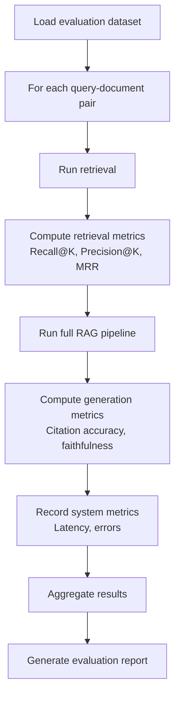

# DocuMind AI — Evaluation Framework

> **Status:** Draft v1.0
> **Last updated:** 2026-08-15
> **Decision key:** DECIDED · PROPOSED · OPEN DECISION
>
> This document defines HOW the AI system will be evaluated.
> It does NOT contain performance results — those will be populated during implementation and testing.

---

## 1. Evaluation Goals

The evaluation framework measures three dimensions:

1. **Retrieval quality** — Does the system find the right document chunks?
2. **Generation quality** — Are the AI-generated answers correct, faithful, and well-cited?
3. **System performance** — Is the system fast and reliable enough for production use?

---

## 2. Retrieval Metrics

### 2.1 Metrics

| Metric | Definition | Target |
|--------|-----------|--------|
| **Recall@K** | Fraction of relevant chunks in the ground-truth set that appear in the top-K retrieval results | To be determined empirically |
| **Precision@K** | Fraction of the top-K retrieval results that are relevant | To be determined empirically |
| **MRR** (Mean Reciprocal Rank) | Average of 1/rank for the first relevant result across queries | To be determined empirically |
| **Hit Rate@K** | Fraction of queries where at least one relevant chunk is in top-K | To be determined empirically |

### 2.2 Evaluation Process

1. Prepare an evaluation dataset (see Section 5)
2. For each query, run retrieval against Qdrant
3. Compare retrieved chunk IDs against ground-truth relevant chunk IDs
4. Compute metrics at K = 3, 5, 10

### 2.3 Variables to Test

| Variable | Options |
|----------|---------|
| Embedding model | Gemini Embeddings (e.g. gemini-embedding-2) |
| Chunking strategy | Fixed-size (256/512/1024 tokens), semantic |
| Query preprocessing | Raw query, query expansion, instruction-prefixed |
| K value | 3, 5, 10, 20 |
| Reranking | None, cross-encoder |

---

## 3. Generation Metrics

### 3.1 Metrics

| Metric | Definition | Evaluation Method |
|--------|-----------|-------------------|
| **Answer Correctness** | Does the answer accurately address the question? | Human evaluation or LLM-as-judge |
| **Faithfulness** | Is every claim in the answer supported by the retrieved context? | Manual verification or automated check |
| **Citation Accuracy** | Do citations point to the correct source chunks? | Automated: match citation IDs against retrieved chunks |
| **Citation Completeness** | Are all factual claims backed by citations? | Manual review |
| **Hallucination Rate** | Fraction of responses containing claims not supported by context | Manual review |
| **Refusal Accuracy** | Does the system correctly refuse when the answer is not in the context? | Automated: test with out-of-scope queries |

### 3.2 Evaluation Process

1. For each query in the evaluation dataset:
   - Run full RAG pipeline (retrieve + generate)
   - Compare generated answer against reference answer
   - Verify each citation against source chunks
   - Flag any unsupported claims
2. Aggregate scores across the dataset

### 3.3 LLM-as-Judge (PROPOSED)

For scalable evaluation, use a separate LLM to judge answer quality:

| Dimension | Judging Prompt |
|-----------|---------------|
| Correctness | "Given the reference answer and the generated answer, rate correctness 1-5" |
| Faithfulness | "Given the context chunks and the generated answer, is every claim supported? Rate 1-5" |
| Completeness | "Does the generated answer address all aspects of the question? Rate 1-5" |

**OPEN DECISION:** Which LLM to use as judge. Should be different from the generation model to avoid self-evaluation bias.

---

## 4. System Performance Metrics

### 4.1 Metrics

| Metric | Definition | Measurement |
|--------|-----------|-------------|
| **Ingestion Latency** | Time from upload to document becoming "ready" | Measured per document, segmented by page count |
| **Embedding Latency** | Time to embed all chunks for a document | Measured per document |
| **Retrieval Latency** | Time for Qdrant search to return results | Measured per query (P50, P95, P99) |
| **Generation Latency** | Time from query receipt to full response delivery | Measured per chat request (P50, P95, P99) |
| **End-to-End Latency** | Total time from user sending query to seeing the answer | Measured per chat interaction |
| **Failure Rate** | Percentage of requests that result in errors | Measured per endpoint |
| **Processing Success Rate** | Percentage of documents that process successfully | Measured across all upload attempts |

### 4.2 Performance Budgets (PROPOSED)

These are aspirational targets, not verified benchmarks:

| Operation | Target |
|-----------|--------|
| Retrieval (Qdrant search) | < 200ms P95 |
| Full RAG (retrieve + generate) | < 5s P95 |
| Document processing (< 20 pages) | < 60s |
| Document processing (< 100 pages) | < 5min |
| API response (non-AI) | < 200ms P95 |

**Note:** These targets have NOT been validated. Actual performance depends on infrastructure, model size, and document complexity.

---

## 5. Evaluation Dataset

### 5.1 Dataset Structure

The evaluation dataset should contain:

| Field | Description |
|-------|-------------|
| `document_id` | Reference to test document |
| `document_type` | PDF, DOCX, scanned image |
| `query` | User question |
| `reference_answer` | Human-written correct answer |
| `relevant_chunk_ids` | Ground-truth chunk IDs that contain the answer |
| `relevant_pages` | Page numbers where the answer can be found |
| `difficulty` | easy, medium, hard |
| `category` | factual, analytical, comparison, table, multi-hop |

### 5.2 Dataset Composition

| Category | Description | Example |
|----------|-------------|---------|
| **Factual** | Direct fact lookup | "What year was the study published?" |
| **Analytical** | Requires reasoning over text | "What are the implications of finding X?" |
| **Table** | Answer requires table data | "What was the revenue in Q3?" |
| **Multi-hop** | Answer spans multiple chunks/pages | "How does the conclusion relate to the hypothesis in the introduction?" |
| **Out-of-scope** | Answer is NOT in the document | "What is the capital of France?" (for a medical paper) |
| **Comparison** | Compare information across sections/documents | "How do the two methods differ in accuracy?" |

### 5.3 Dataset Size

**PROPOSED:**
- Minimum 50 query-answer pairs for initial evaluation
- Distributed across categories and difficulty levels
- Covering at least 5 different test documents
- Include at least 5 scanned/OCR documents

### 5.4 Dataset Creation Process

1. Select representative test documents (mix of formats, lengths, content types)
2. Process documents through the pipeline
3. Manually create queries spanning different categories
4. Manually identify relevant chunks and write reference answers
5. Peer review for accuracy and completeness

**OPEN DECISION:** Whether to use synthetic evaluation data generated by an LLM to supplement manual data. Useful for scale but may introduce biases.

---

## 6. Evaluation Pipeline

### 6.1 Automated Evaluation

### 6.2 Evaluation Frequency

| Trigger | What to Evaluate |
|---------|-----------------|
| Embedding model change | Full retrieval evaluation |
| Chunking strategy change | Full retrieval + generation evaluation |
| LLM model/provider change | Full generation evaluation |
| Prompt template change | Generation evaluation |
| System architecture change | System performance evaluation |
| Before release | Full evaluation |

---

## 7. Langfuse Integration

Langfuse provides ongoing observability (not batch evaluation):

| What Langfuse Tracks | Purpose |
|---------------------|---------|
| LLM call traces | Monitor individual request quality |
| Token usage | Track cost per query |
| Latency breakdown | Identify bottlenecks |
| Error rates | Monitor reliability |
| User feedback (future) | Collect implicit quality signals |

**PROPOSED:** Use Langfuse scores/annotations to flag low-quality responses for manual review during development.

---

## 8. Open Decisions

| ID | Decision | Status |
|----|----------|--------|
| OD-EVAL-01 | LLM-as-judge model selection | OPEN DECISION |
| OD-EVAL-02 | Synthetic evaluation data generation | OPEN DECISION |
| OD-EVAL-03 | Exact retrieval K values for evaluation | PROPOSED: 3, 5, 10 |
| OD-EVAL-04 | User feedback collection mechanism | OPEN DECISION, P1+ |
| OD-EVAL-05 | CI/CD integration for automated evaluation | OPEN DECISION, post-MVP |
