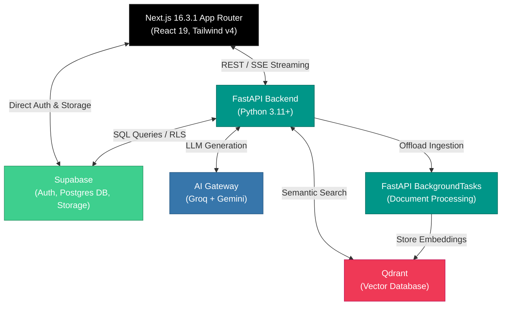
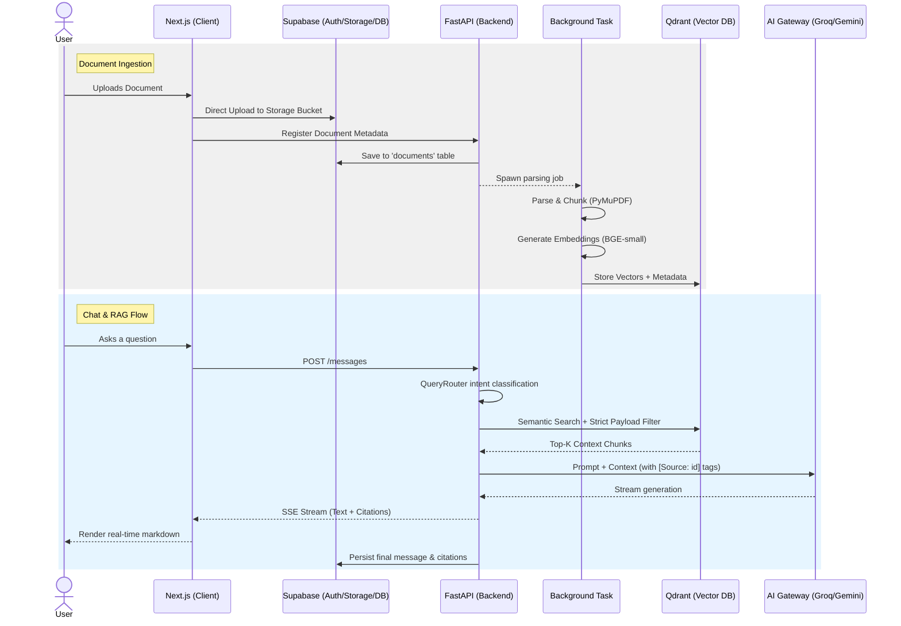

<div align="center">
  <h1>DocuMind AI</h1>
  <p><strong>A True Page-Aware Multimodal RAG Workspace</strong></p>
  
  [](https://www.typescriptlang.org/)
  [](https://nextjs.org/)
  [](https://fastapi.tiangolo.com/)
  [](https://www.python.org/)
  [](https://supabase.com/)
  [](https://qdrant.tech/)
</div>

<br />

DocuMind AI is a full-stack, production-ready AI workspace that allows users to upload documents (PDFs, DOCX, images) and interact with them through natural language. Built with a focus on reliability, true page-aware citations, and streaming performance, DocuMind AI ensures that every answer is grounded in your actual documents—not hallucinated.

---

## Table of Contents

- [What is DocuMind AI?](#what-is-documind-ai)
- [Why DocuMind AI is Different](#why-documind-ai-is-different)
- [Features](#features)
- [System Architecture](#system-architecture)
- [End-to-End Data Flow](#end-to-end-data-flow)
- [RAG Architecture](#rag-architecture)
- [Chat & Conversation Architecture](#chat--conversation-architecture)
- [AI Gateway](#ai-gateway)
- [Real-Time Streaming](#real-time-streaming)
- [Security](#security)
- [Database Design](#database-design)
- [Project Structure](#project-structure)
- [API Overview](#api-overview)
- [Tech Stack](#tech-stack)
- [Environment Variables](#environment-variables)
- [Local Development](#local-development)
- [Testing](#testing)
- [Production & Deployment](#production--deployment)
- [Performance Engineering](#performance-engineering)
- [Known Limitations](#known-limitations)
- [Future Improvements](#future-improvements)

---

## What is DocuMind AI?

Normal Retrieval-Augmented Generation (RAG) systems fail when asked specific, structural questions like *"What is on page 4?"* or *"Compare pages 10 and 12"*, because they rely entirely on semantic similarity rather than document structure. 

DocuMind AI solves this by combining semantic search with strict structural metadata filtering. It understands the physical structure of your documents (pages, ranges) and dynamically routes your queries to the right retrieval strategy, ensuring grounded, accurate answers with exact page citations.

---

## Why DocuMind AI is Different

- **Page-Aware Retrieval**: Ask for specific pages, and the backend explicitly filters the vector search by page number.
- **Multi-Page & Range Queries**: Ask to compare specific pages (e.g., *"Compare pages 10 and 15"*).
- **Persistent Conversation History**: A ChatGPT-style sidebar allows you to maintain multiple ongoing conversations per document.
- **Robust SSE Streaming**: A custom streaming parser that handles arbitrary TCP chunk boundaries without dropping tokens.
- **Resilient AI Fallback**: Groq handles primary generation for ultra-low latency, seamlessly falling back to Google Gemini on rate limits or failures.
- **Secure Isolation**: Supabase Row Level Security (RLS) ensures absolute data privacy across users.

---

## Features

- **Authentication**: Full signup, sign-in, forgot/reset password flows (via Supabase Auth) with password visibility toggles.
- **Document Management**: Upload PDFs, DOCX, and images. Documents are processed asynchronously via FastAPI BackgroundTasks.
- **Multimodal Intelligence**: Extracts text, tables, and processes images natively via Google Gemini.
- **ChatGPT-Style Chat**: 
  - Persistent chat history across page refreshes.
  - Multiple distinct conversations per document.
  - Sidebar for conversation switching and navigation.
  - Cross-document conversation navigation.
- **Advanced Querying**:
  - Page-specific questions (e.g., *"Summarize page 5"*).
  - Multi-page comparison.
  - Document summarization.
  - General semantic Q&A.
- **Reliability & UX**:
  - Real-time SSE streaming.
  - Automatic AI provider fallback.
  - Explicit inline citations linked to source pages.
  - Graceful error boundaries and frontend handling.

---

## System Architecture



Authentication is handled directly between the Client and Supabase via JWTs. The Client passes the JWT to the FastAPI backend, which enforces authorization against Supabase and Qdrant payloads. Storage is handled via Supabase Storage buckets.

---

## End-to-End Data Flow

1. **Upload**: User uploads a document. The client gets a signed URL from Supabase and uploads the file directly to Storage.
2. **Registration**: The frontend registers the document with the FastAPI backend.
3. **Processing**: FastAPI hands the processing off to a `BackgroundTask`.
4. **Chunking**: The document is parsed (PyMuPDF/python-docx), and text/images are chunked.
5. **Embedding**: `BAAI/bge-small-en-v1.5` generates embeddings.
6. **Storage**: Vectors are pushed to Qdrant (tagged with `user_id` and `document_id`).
7. **Querying**: User asks a question in the chat UI.
8. **Routing**: The backend `QueryRouter` classifies the intent (e.g., `PAGE_QUERY`).
9. **Retrieval**: Qdrant retrieves relevant chunks using payload filters.
10. **Context**: Context is injected into the LLM prompt with explicit `[Source: id]` tags.
11. **Generation**: The AI Gateway streams the response from Groq (or Gemini).
12. **Streaming**: The frontend parses the SSE stream and renders markdown/citations.
13. **Persistence**: The final message and citations are persisted to the Supabase PostgreSQL database.

### Workflow Visualization



---

## RAG Architecture

The RAG pipeline is built around a deterministic `QueryRouter` that classifies user intent via regex and NLP heuristics into five categories:
- `PAGE_QUERY`: "What is the total on page 4?" -> Applies a strict Qdrant payload filter for `page_number == 4`.
- `MULTI_PAGE_QUERY`: "Compare pages 10 and 18." -> Filters for `page_number IN [10, 18]`.
- `PAGE_RANGE_QUERY`: "Summarize pages 10-15." -> Filters for `page_number >= 10 AND page_number <= 15`.
- `DOCUMENT_SUMMARY`: "Summarize this document." -> Retrieves the introduction, conclusion, and a dense sample of chunks.
- `GENERAL_SEMANTIC`: Standard vector similarity search.

If retrieval yields zero results (e.g., asking about page 99 in a 5-page document), the system gracefully informs the user rather than hallucinating an answer.

---

## Chat & Conversation Architecture

DocuMind AI utilizes a persistent, ChatGPT-style conversation model:
- **Conversations**: A user can have multiple active conversations per document.
- **Persistence**: Chat history is persisted in PostgreSQL. refreshing the page or switching documents retains the exact chat state.
- **Lazy Creation**: A conversation is only created in the database when the user sends their *first* message, preventing empty orphaned threads.
- **Sidebar Navigation**: Users can instantly switch between ongoing conversations via the collapsible sidebar.

---

## AI Gateway

To guarantee uptime and minimize latency, DocuMind implements a custom `AIGateway` (`app.ai.gateway`). 

- **Primary Provider**: **Groq** (`qwen/qwen3.6-27b`) for ultra-fast text inference.
- **Primary Fallback**: **Google Gemini** (`gemini-3.5-flash`) takes over seamlessly if Groq hits rate limits (HTTP 429), goes offline (HTTP 503), or if the query requires multimodal vision context.
- **Secondary Fallback**: If `gemini-3.5-flash` fails, it cascades to `gemini-3.6-flash`.

The gateway is built with asynchronous Python, specifically catching `Event loop is closed` errors and re-instantiating clients to ensure long-running workers never hang.

---

## Real-Time Streaming

Instead of relying on brittle generic fetch loops, DocuMind AI implements a custom Server-Sent Events (SSE) parser (`extractSseEvents` in `ChatPanel.tsx`). 

TCP chunks do not respect application-level message boundaries. Our parser maintains a mutable string buffer, slicing off complete JSON payloads only when a `\n\n` boundary is detected. This prevents `JSONDecodeError`s when a single generated word is split across two network packets, ensuring a flawlessly smooth typing animation.

---

## Security

DocuMind AI employs strict security isolation:
- **Supabase Authentication**: Secure JWT generation and session management.
- **Supabase RLS**: PostgreSQL Row Level Security guarantees that users can only `SELECT`, `INSERT`, `UPDATE`, or `DELETE` documents, conversations, and messages where `user_id == auth.uid()`.
- **Backend Authorization**: The FastAPI backend validates the Supabase JWT on every request via dependency injection (`get_current_user`).
- **Qdrant Filtering**: Qdrant does *not* support database-level RLS. Therefore, the FastAPI backend strictly enforces a `Must(FieldCondition(key="user_id", match=MatchValue(value=current_user.id)))` filter on *every single* vector search.
- **Secrets Management**: All keys are loaded via `pydantic-settings` from environment variables.

---

## Database Design

The relational database is powered by PostgreSQL (via Supabase) with the following core entities:

- `users`: Managed entirely by Supabase Auth (`auth.users`).
- `profiles`: Application-level user data, synced via triggers.
- `documents`: Metadata, upload status, and page counts.
- `conversations`: Belongs to a user and a document. Allows multiple threads per document.
- `messages`: Belongs to a conversation. Stores the user query and assistant response.
- `citations`: Belongs to a message. Stores the exact document chunk and page number referenced by the LLM.

All user-facing tables enforce Foreign Key constraints cascading on delete, and strict RLS policies.

---

## Project Structure

```text
DocuMind AI/
├── apps/
│   ├── web/           # Next.js 16.3.1 frontend (React 19, Tailwind v4)
│   └── api/           # FastAPI backend (Python 3.11+)
├── docs/              # Architectural decision records
├── .env.example       # Environment template
├── docker-compose.yml # Local infrastructure (Qdrant)
└── package.json       # Workspace root (if applicable)
```

---

## API Overview

Key FastAPI endpoints:
- **Auth**: Handled by Supabase SDK natively on the frontend.
- **Documents**:
  - `POST /api/v1/documents` - Register a newly uploaded document.
  - `GET /api/v1/documents/{id}` - Fetch document status.
- **Conversations**:
  - `POST /api/v1/conversations` - Create a new chat thread.
  - `GET /api/v1/conversations/{id}` - Load chat history.
- **Chat**:
  - `POST /api/v1/conversations/{id}/messages` - Stream an AI response (SSE).

---

## Tech Stack

| Layer | Technology |
| :--- | :--- |
| **Frontend** | Next.js 16.3.1 (App Router), React 19.2.8, Tailwind CSS v4, shadcn/ui |
| **Backend API** | FastAPI 0.115+, Python 3.11+ |
| **Database** | PostgreSQL (Supabase) |
| **Vector DB** | Qdrant 1.9.0+ |
| **AI Generation** | Groq (`qwen/qwen3.6-27b`), Gemini (`gemini-3.5-flash`) |
| **AI Embeddings** | `BAAI/bge-small-en-v1.5` |
| **Auth & Storage**| Supabase Auth, Supabase Storage |
| **Deployment** | Docker |

---

## Environment Variables

Copy `.env.example` to `.env` and populate the values. **Never commit `.env`**.

- `NEXT_PUBLIC_SUPABASE_URL`: Supabase project URL (Frontend & Backend).
- `NEXT_PUBLIC_SUPABASE_ANON_KEY`: Supabase Anon key (Frontend & Backend).
- `NEXT_PUBLIC_API_URL`: FastAPI url (e.g., `http://localhost:8000`).
- `SUPABASE_SERVICE_ROLE_KEY`: Supabase Service Role key (Backend only).
- `DATABASE_URL`: Postgres connection string (Backend only).
- `QDRANT_URL`: URL for Qdrant (e.g., `http://localhost:6333`).
- `GROQ_API_KEY`: Key from console.groq.com.
- `GEMINI_API_KEY`: Key from aistudio.google.com.

---

## Local Development

### 1. Clone & Configure
```bash
git clone https://github.com/aryxn-builds/DocuMind-AI.git
cd "DocuMind AI"
cp .env.example .env
# Fill in your API keys in the .env file
```

### 2. Start Infrastructure (Qdrant)
Ensure Docker Desktop is running.
```bash
docker compose up -d qdrant
```

### 3. Start Backend (FastAPI)
```bash
cd apps/api
python -m venv .venv

# Activate virtual environment
# Windows:
.venv\Scripts\activate
# Mac/Linux:
source .venv/bin/activate

pip install -r requirements.txt
python -m uvicorn app.main:app --reload --port 8000
```

### 4. Start Frontend (Next.js)
Open a new terminal.
```bash
cd apps/web
npm install
npm run dev
```
Access the app at `http://localhost:3000`.

---

## Testing

The backend includes a robust Pytest suite, specifically focusing on the complex SSE streaming logic and parser framing.

To run backend tests:
```bash
cd apps/api
pytest tests/
```

To run frontend type checking:
```bash
cd apps/web
npm run build
```

---

## Production & Deployment

- **Frontend**: Deployable to Vercel via standard Next.js build presets. Ensure all `NEXT_PUBLIC_` variables are set in the Vercel dashboard.
- **Backend**: Containerize using Docker and deploy to Render, AWS ECS, or Google Cloud Run. Ensure `Uvicorn` workers are configured appropriately for production traffic.
- **Infrastructure**: Use managed Supabase for PostgreSQL/Auth/Storage and managed Qdrant Cloud for the vector database.
- **Auth Configuration**: Ensure your production frontend URL is added to the Supabase Auth "Redirect URLs" dashboard.

---

## Performance Engineering

- **SSE Buffering**: The frontend parsing loop prevents React re-renders on malformed TCP chunks, significantly reducing main-thread CPU load during fast generations.
- **AI Gateway Fast-Fails**: The AI gateway identifies non-recoverable HTTP 400 errors immediately, skipping retry loops to fail fast and fall back to secondary providers instantly.
- **N+1 Query Elimination**: Citations are fetched and embedded directly via PostgreSQL relationships, rather than looping individual lookups.
- **Event-Loop Safety**: Asynchronous Gemini clients are rigorously managed to prevent `Event loop is closed` fatal crashes under high concurrency.

---

## Known Limitations

- **Background Jobs**: Currently utilizes FastAPI `BackgroundTasks`. If the backend process crashes or restarts (common on free-tier hosts like Render), pending document ingestions will be lost.
- **Vector Search Context Limits**: Extremely massive documents may exceed the context window if the `DOCUMENT_SUMMARY` heuristic pulls too many chunks.

---

## Future Improvements

- **Dedicated Worker Queue**: Migrate FastAPI `BackgroundTasks` to Celery or RQ with Redis to ensure ingestion durability.
- **Advanced Reranking**: Implement Cohere or mixedbread-ai rerankers after the initial Qdrant retrieval step to boost citation accuracy.
- **Hybrid Search**: Combine BM25 keyword search with Qdrant dense vectors for exact-match term queries (e.g., serial numbers).
- **Observability**: Complete the Langfuse integration for tracing LLM latency and prompt evaluation.

---

## License

This repository currently has no declared license. All rights reserved by the author.

## Author

Developed for DocuMind AI.
