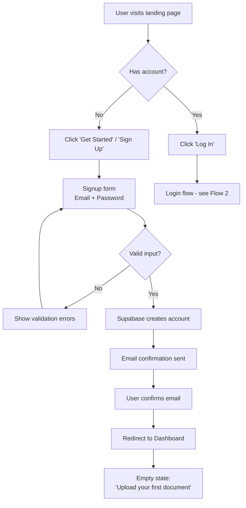
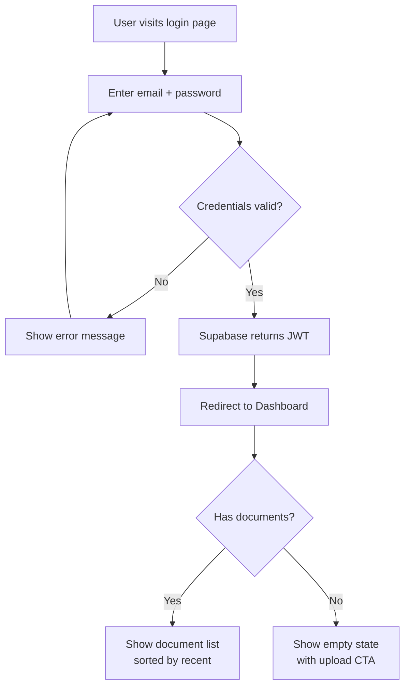
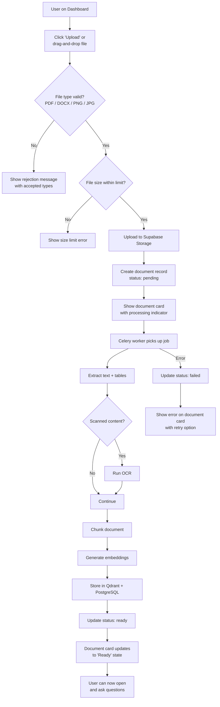
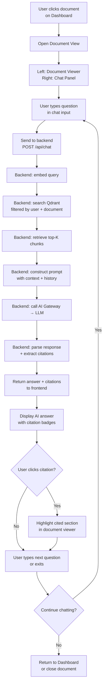
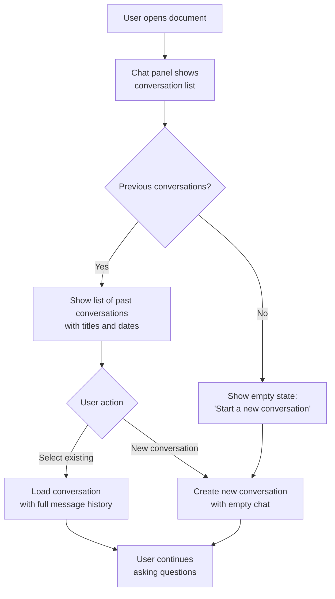
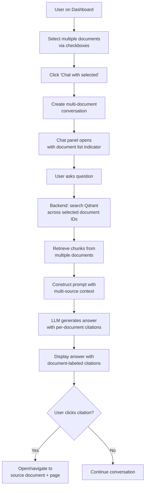
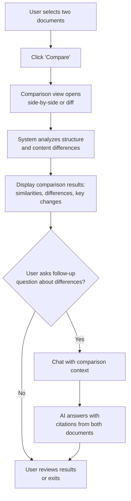
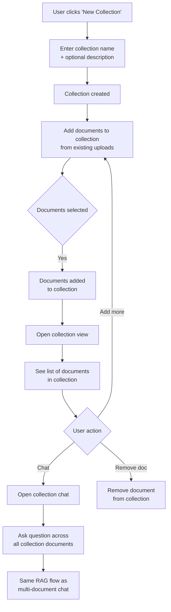
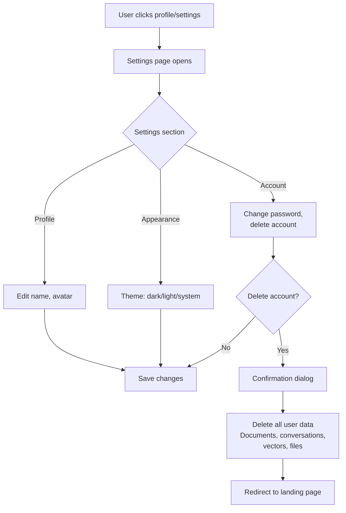
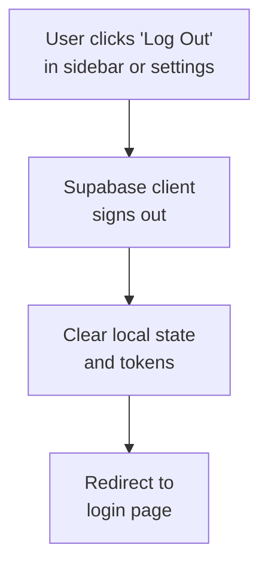

# DocuMind AI — User Flows

> **Status:** Draft v1.0
> **Last updated:** 2026-08-15

---

## 1. Landing → Signup → Dashboard

**Screens involved:**
1. Landing page (marketing)
2. Signup form
3. Email confirmation notice
4. Dashboard (empty state)

---

## 2. Login → Dashboard

**Screens involved:**
1. Login form
2. Dashboard (populated or empty)

---

## 3. Upload Document → Processing → Ready

**Screens involved:**
1. Dashboard with upload zone
2. Upload progress indicator
3. Document card (processing → ready → failed states)

**OPEN DECISION:** Whether processing status updates via polling or real-time (WebSocket/SSE).

---

## 4. Open Document → Ask Question → Answer → Citation → Page

**Screens involved:**
1. Document view (split: viewer + chat)
2. Chat panel with messages and citations
3. Document viewer with citation highlighting

**Key interactions:**
- Chat messages appear in real-time as the LLM streams (if streaming is supported)
- Citation badges [1] [2] are clickable
- Clicking a citation scrolls the document viewer to the relevant page/section
- Previous conversation turns are visible and scrollable

---

## 5. Chat History

**Screens involved:**
1. Conversation list (sidebar or dropdown in chat panel)
2. Chat panel with loaded history

---

## 6. Multi-Document Chat (P1)

**Screens involved:**
1. Dashboard with multi-select mode
2. Multi-document chat view
3. Citation with document source labels

---

## 7. Document Comparison (P1)

**Screens involved:**
1. Comparison selection
2. Comparison results view
3. Comparison chat panel

**OPEN DECISION:** Comparison UI layout (side-by-side panels, unified diff view, or structured summary).

---

## 8. Create Collection → Add Documents → Ask Collection (P1)

**Screens involved:**
1. Collection creation modal/form
2. Collection detail view (document list)
3. Document picker (add to collection)
4. Collection chat

---

## 9. Settings

**Screens involved:**
1. Settings page with section tabs
2. Confirmation dialogs for destructive actions

**OPEN DECISION:** Additional settings (notification preferences, AI model preferences, default behavior). Defer to post-MVP.

---

## 10. Logout

**Screens involved:**
1. Any screen with logout action
2. Login page (post-logout)

---

## 11. Screen Inventory

| Screen | Priority | Flows |
|--------|----------|-------|
| Landing page | P0 | 1 |
| Signup form | P0 | 1 |
| Login form | P0 | 2 |
| Dashboard (documents list) | P0 | 2, 3, 6, 7, 8 |
| Document view (viewer + chat) | P0 | 4, 5 |
| Upload zone / modal | P0 | 3 |
| Settings page | P0 | 9 |
| Collection detail view | P1 | 8 |
| Multi-document chat | P1 | 6 |
| Comparison view | P1 | 7 |
| Empty states (per screen) | P0 | All |
| Error states (per screen) | P0 | All |
